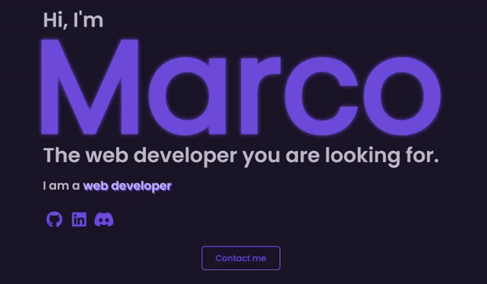

# Marco Lovato Page

This is my first personal work , [watch it here](https://marcolovatopage.netlify.app/?target=_blank).   
I made it as my first [Start2Impact](https://www.start2impact.it/?target=_blank) student assignment.  
 The exercise involves the use of HTML and CSS.  
I added JS to make the site more dynamic for long-term use.  

## Used technologies

- HTML
- CSS
- JavaScript
- Jquery
- Swiper
- Formsubmit.co
- Animate.css

## The animations and effects

List in order:
- The possibility of dark theme in the header
- The letters "Marco" in the home section.
- The carousel word's in the home section.
- The subtitles in the sections with an effect on hover done with animate.css .
- The blob with the profile image in the about section.
- The cards effect slider done with Swiper in about section.
- The modal on the cards in the about section.
- The waves in the footer.
- The social icons in the navbar, home and in the footer.

